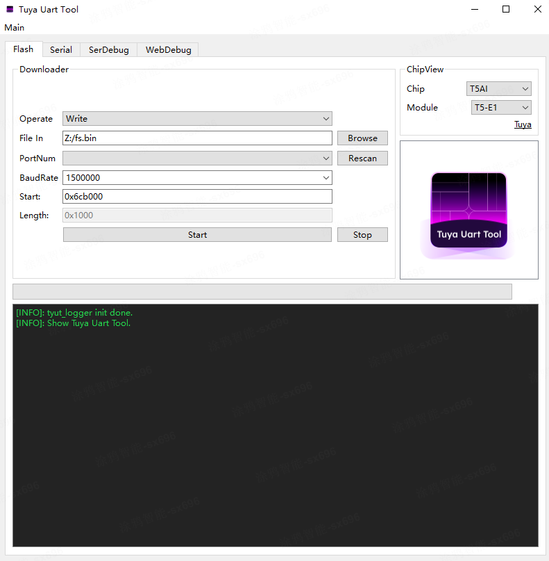
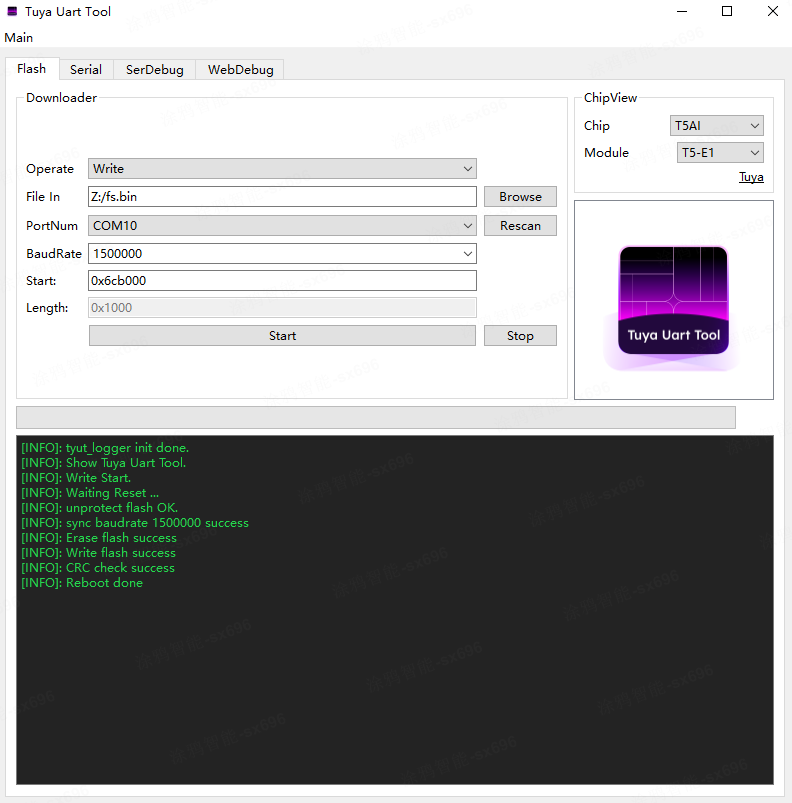

English | [简体中文](./RAEDME_zh.md)

# your_robot_dog

[your_robot_dog](https://github.com/tuya/TuyaOpen/tree/master/apps/tuya.ai/your_robot_dog) is ported from TuyaOS's `tuyaos_demo_ai_toy` project, based on TuyaOpen's `your_char_bot`. It adds vivid facial expressions and servo-driven actions for a robot dog, bringing an open-source LLM-powered chat robot dog to TuyaOpen.

It captures voice via microphone, performs speech recognition, and supports conversation, interaction, and playful banter. You can also see emotion changes on the screen and observe interactive behaviors.

## Features

1. AI intelligent conversation
2. Button wake / voice wake, turn-based conversation, and supports voice barge-in (requires hardware support)
3. Expression display
4. Supports LCD to show chat content in real time; supports viewing chat content in real time from the App
5. Switch AI agent roles in real time from the App
6. Voice control of robot dog behaviors

## Required hardware capabilities

1. Audio capture
2. Audio playback
3. Servo driver

## Supported hardware

| Model | config |
| --- | --- |
| TUYA_T5AI_ROBOT_DOG | TUYA_T5AI_ROBOT_DOG.config |

## Flashing (hardware wiring)

Prepare a CH340 USB-to-serial adapter. Wiring:

TX  -------------- RX0
RX  -------------- TX0
RST -------------- RST

To view serial logs:

TX  -------------- RX_L
RX  -------------- TX_L
GND -------------- GND

GND must be shared, otherwise logs may be garbled.

## Build

1. Run `tos.py config choice` and select `TUYA_T5AI_ROBOT_DOG.config`.
2. If you need to change configurations, run `tos.py config menu` first.
3. Run `tos.py build` to build the project.

## Usage

### First boot & network provisioning

When the device boots for the first time, the status bar at the top shows "Provisioning". You can start provisioning at this time.

Provisioning is successful when:

- The Wi-Fi icon shows a signal
- The top status bar changes from "Provisioning" to "Standby"

When the robot dog says "I'm online, let's start talking", you can proceed to chat.

### Conversation modes

There are four conversation modes:

1. Press-and-hold mode
2. Button mode
3. Wake-word mode
4. Free-talk mode

### Switch conversation mode

Quickly press the button twice in succession to switch the conversation mode. After switching, the robot dog will say: "Press-and-hold / Button / Wake-word / Free-talk".

## Configuration

### Default configuration

- Free-talk mode, AEC disabled, no barge-in
- Wake word:
	- T5AI version: 你好涂鸦

### Common options

- **Choose Language**

	Run the tos.py config menu command and select Chinese or English in the "choose ai language" option.

- **Select conversation mode**

	- Press-and-hold mode

		| Option | Description |
		| --- | --- |
		| enable ai mode hold | Hold the button while speaking; release the button after finishing one sentence. |

	- Button mode

		| Option | Description |
		| --- | --- |
		| enable ai mode oneshot | Press the button once to enter/exit listening. In listening state, VAD detection is enabled and you can talk. |

	- Wake-word mode

		| Option | Description |
		| --- | --- |
		| enable ai mode wakeup | You must say the wake word to wake the device. After waking, it enters listening mode for one round only. To continue, wake it again using the wake word. |

	- Free-talk mode

		| Option | Description |
		| --- | --- |
		| enable ai mode free | You must say the wake word to wake the device. After waking, it enters listening mode and you can talk freely. If no sound is detected for 30 seconds, you need to wake it again. |

- **Enable display / actions**

	| Option | Description |
	| --- | --- |
	| enable ai chat display ui | Enable display UI. Turn this on if the board has a screen. |
	| enable the dog action | Enable robot dog actions. |

### File system (LittleFS) configuration

Required: some robot dog expression GIFs are packed as a LittleFS image at `./src/display/emotion/fs/fs.bin`. You must flash it to the specified address in FLASH.

If not configured, the system may reboot unexpectedly or expressions may be incomplete.

Steps:

1. Download TuyaOpen's official flashing tool TyuTool. TyuTool is a cross-platform serial tool for IoT developers, used to flash and read firmware for mainstream chips.
2. In "Operate", select "Write"; in "File In", select the path to `fs.bin`.
3. In "Start", set the start address for `fs.bin` to `0x6cb000`, then click the "Start" button to flash.

4. As shown below, flashing is successful.

#### How to generate fs.bin yourself (optional)

If you need to add/remove expressions, you can re-pack locally:

1. Prepare GIFs
   Rename your expression files to:
   `angry.gif confused.gif disappointed.gif embarrassed.gif happy.gif laughing.gif relaxed.gif sad.gif happy.gif surprise.gif thinking.gif`
   and put them all into an empty directory, e.g. `/tmp/gif_pack`.

   Notes:
   - Total size of all GIFs must be < 1 MB.
   - The device loads via absolute paths like `/angry.gif`, so file names must match what the code expects.

2. One-command pack
   Use the `mklittlefs` tool. Usage is documented at:
   `TuyaOpen/platform/T5AI/t5_os/ap/components/littlefs/mkimg/README.md`

   Run from the TuyaOpen root directory:

   platform/T5AI/t5_os/ap/components/littlefs/mkimg/mklittlefs \
     -c /tmp/gif_pack \
     -b 4096 -p 256 -s 1048576 \
     apps/tuya.ai/your_robot_dog/fs.bin

	After running the command, `fs.bin` will be generated under `apps/tuya.ai/your_robot_dog`.

	Parameter meanings:
	- `-c`: source directory
	- `-b`: block size
	- `-p`: page size
	- `-s`: image size (1 MB)

## Notes

`your_robot_dog` is a ported project. The baseboard of `TUYA_T5AI_ROBOT_DOG` differs significantly from the standard T5AI development board.

Camera functionality is not supported yet.

